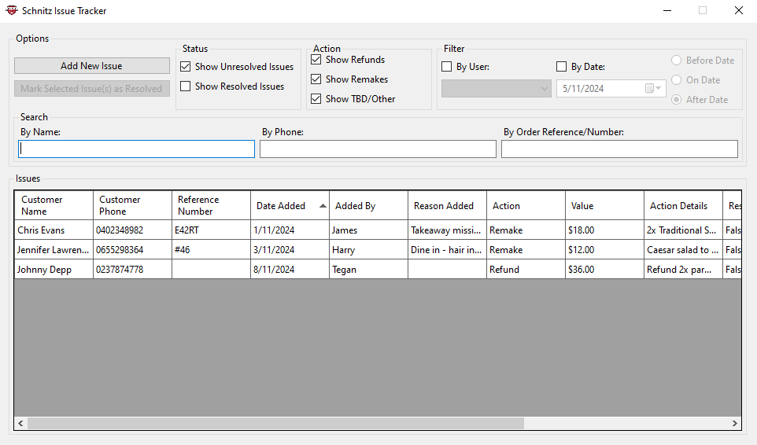

# SchnitzIssueTracker
An application made for Schnitz to keep track of issues.

---
## Contents

Contains:
- Local database using SQLite.
- Ability to create a new ticket to be tracked.
    - Customer Name.
    - Customer Phone.
    - Order Reference/Number.
    - Explanation of Issue.
    - Date Added.
    - Added by ____ User.
    - Action to be Taken.
        - Refund.
        - Remake.
        - Other / TBD.
    - Dollar Value.
    - Explanation of Action to be Taken.
    - Set Resolution Status to Unresolved.
- Ability to resolve a ticket.
    - Resolved by ____ User.
    - Date of Resolution.
    - Modify Action Taken.
    - Explanation of the Action Taken.
    - Set Resolution Status to Resolved.
- User control.
    - Add new users.
    - Delete past users.
    - Keeps track of who changed what.
- Issue browser.
    - Sort Tickets...
        - by Customer Name.
        - by Date Added.
        - by User Added.
        - by Action Taken.
        - by Value.
        - by Resolution Status.
        - by Date Resolved.
        - by User Resolved.
    - Filter Tickets...
        - by Resolution Status.
        - by Action Taken.
        - by User Added.
        - by Date Added.
            - Before Selected Date.
            - On Selected Date.
            - After Selected Date.
    - Search Tickets...
        - by Customer Name.
        - by Customer Phone.
        - by Order Reference/Number.

---

## Installation and Usage

Download the .zip file from releases. Run the executable. You can optionally pin the application to task bar, or create a desktop shortcut.

The database will be automatically created on first run. Select "Add New Issue", to add a new ticket to the tracker. Select "Edit Users" from that page to modify the tracked users. You can add or remove users from here.

Once at least one user is added, select the user, input information into the tracker, and press "Add Issue". You can repeat for as many tickets as you have to populate the tracker.

When you close this window, the main tracker page will automatically update with the tickets. You can use the options and search bars at the top of this page to filter and search through tickets. Click the column names in the table to sort by that column. Not every column has sorting enabled.

To mark an issue as resolved, select the issue (or CTRL-Click, SHIFT-Click, or Click+Drag to select multiple to resolve all at once). Select the user, fill in the details. The action taken can be modified here to be finalised with the ticket. Then press the "Resolve Issue" button.

That is all there is to it!

